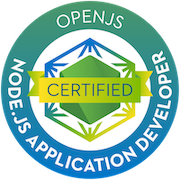

## Rodrigo Moreno 🇲🇽 ([He/Him](https://pronoun.is/he/him))
### Head of Engineering @ Flux QR
___

Hi, I'm a guy who loves programming, learn new technologies and I want to be Pokemon master.

Currently I work at [Flux QR](https://paywithflux.com) as head of engineering designing and developing internal systems to create a mobile payment network based on QR codes.

Last 7 years I was focussed to work with Node.js, JavaScript, postgres and AWS. But during my last 10 years I worked on different types of projects such as mobile apps (iOS & Firefox OS), Wordpress, Samsung SmartTV apps also I worked with PHP, HTML, CSS, Objective-C, Swift, React, React Native.

I love the Pokémon franchise and have played Pokémon Go since it's release in '16 and currently have 639 different species of pokémon registered in my Pokédex. I'm casual gamer and I love simulator games, trying new food and hanging out with friends for beers and playing board games.

## Experience

### **Head of Engineering @ Flux QR (YC s19)**
#### Dec 2019 - Current

I created a new architecture for mobile payment network based on QR codes. I've working with Node.js, postgres, terraform and aws to achieve all challenges we currently have.

I've developed our custom authorizer that has already processed +$2M MXN, I'm also working on the one hand, with small and large commerces allowing them new ways to charge to their customers and on the other hand, I also work with fintechs, neobanks and traditional banks that can use our technology to reach more and new places and their customers can pay in +55k commerces.

I'm responsible for validating and hiring new talent for our technology area. I also supervise their work and work closely with the product area and the CTO to face new challenges and projects. 

---
### **Node.js Developer Sr @ Globant**
#### May 2018 - Dec 2019

I was worked designing, documenting and building REST APIs using Node.js, JavaScript and OpenAPI/Swagger.

For IHS Markit I used pure Node.js and I've worked with their own private npm modules and connected to their information systems. I then worked with Disney to build some APIs that were connected to their ServiceNow instance and consume them from an angular interface.

---
### **Consultant @ Virk**
#### Jan 2018 - Apr 2018

I designed and built some new features for a React Native app for the Cozumel government. I implemented a push notification system in the app and created an admin dashboard to send notifications.

I also helped build and maintain some Wordpress sites that were offered to different governments, political parties and non-profit associations.

---
### **Backend Developer Sr @ Kaeg Media**
#### May 2015 - Dec 2017

I was joined as backend developer to help on a project to create a custom CMS for a B2B platform for luxury travel. On the one hand, a dashboard for suppliers like hotels, planes, ships, etc and on the other hand, luxury travel agencies that can access to all suppliers data. I helped to design and validate a scalable architecture and infrastructure to support high demands on vacation periods.

Also I implemented internal infrastructure to provide repositories and pipelines for CI/CD for other projects including one of the largest cinemas in Mexico and non-profit associations. I also collaborated to design and plan a CDN for a large real estate company in order to provide a single and reliable source of media and information for their different systems and platforms.

---
### **iOS Developer @ Conecta**
#### Feb 2015 - May 2015

I was responsible for three mobile apps that enables more security for final customers, I used SafeNet's MobilePass SDK to create custom flows for each app required by clients. I was create two apps for Mexico and one for Colombia.

I also developed iOS app for Bankaool, the first fully mobile bank without physical offices.

---
### **Developer @ CTIN**
#### Jan 2014 - Oct 2014

I was joined as software engineer and supported some internal projects and collaborated on two important projects for Grupo Carso (Carso's group).

With a small team, we developed and deployed a customized system to collect, analyze and process battery data from Telcel's cell towers and we achieved an optimization and efficacy for this process.

I also collaborated with UNESCO to analyze, discuss and initiate the implementation for largest site dedicated to rock art. I worked with spanish archaeologists to listen their major challenges, understand their workflow, data that collect and some political concerns related with rock art.

---
### **Web Developer @ Innovattia**
#### Nov 2012 - May 2013

I started as web developer creating some WAP portals for feature phones that was consumed through value-added services.

Then I developed a Samsung Smart TV app for the Mexican Ministry of Tourism to promote some destinations in Mexico to visit during "El buen fin" in partnership with us and Samsung Mexico.

Also I migrated a service from Java to PHP. This service works to connect to the SMS infrastructure of the carriers through SMPP protocol.

---
### **iOS Intership @ UNAM Mobile**
#### Mar 2012 - Aug 2012

I joined to UNAM Mobile lab even before entering university and here I began to know and work for first time on iOS mobile apps. As my first experiment I created a facial recognition app that overlaid a meme into your face.

Then I started the research and first experiments to build "Murales CU". An iOS app that could recognize patterns in the university's central library using the device's camera and using RA renders some 3D models and audios to explain the meaning of library's murals.

___

## What's next?

I really love learn new concepts, technologies, languages, frameworks and I have a personal list of new technologies that I want learn:

* [NEAR](https://near.org/)
* [Deno 🦕](https://deno.land/)
* [Rust 🦀](https://www.rust-lang.org/)
* [Erlang](https://www.erlang.org/)/[Elixir](https://elixir-lang.org/)
___

## Certifications

 
